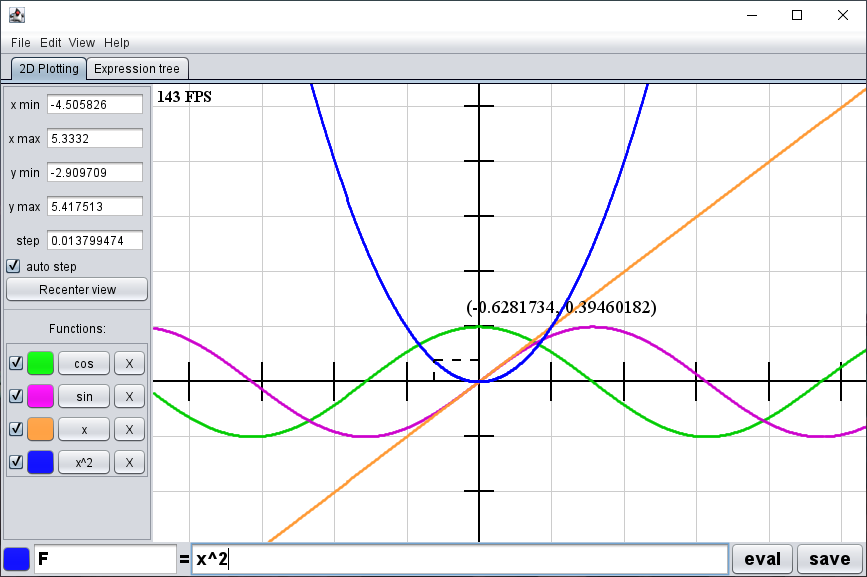
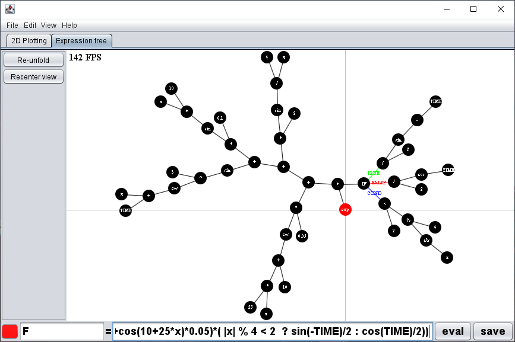

# Project Grapher

 

A simple function plotting tool written in Java.

## Features

- friendly save file format
- options to improve performance/quality
- conditional statements
- boolean logic

### Plotting

- plot multiple functions at once
- animated plotting !

### Expression tree

- interactive !
- physics based simulation

## Exemples

Checkout the provided demo files in the latest release !

## Manual

See the in-app manual in the "Help > Manual" sub menu.
